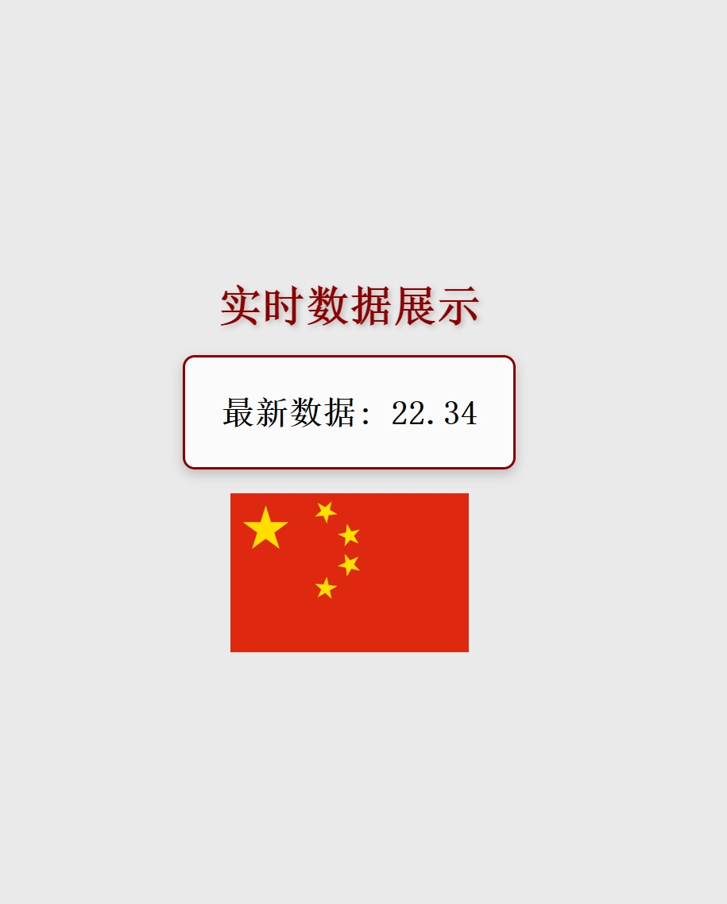

# WebSocket Server Project

<p align="center">
    <br> <a href="README-EN.md">English</a> | 中文
</p>

- [WebSocket Server Project](#websocket-server-project)
  - [Features](#features)
  - [Product Screenshot](#product-screenshot)
  - [Quick Start](#quick-start)
    - [Prerequisites](#prerequisites)
    - [Installation](#installation)
    - [Running the Server](#running-the-server)
    - [Running with Docker](#running-with-docker)
    - [Configuration](#configuration)
  - [Contributing](#contributing)
  - [License](#license)
  - [Contact](#contact)
  - [Project Link](#project-link)


# WebSocket 服务器项目
This is a high-performance WebSocket server project with high scalability, high availability, and internationalization support. The project is based on real-time updates to ensure service stability and efficiency.

## Features

- **High Scalability**: Modular design for easy feature expansion and maintenance, supporting real-time updates.
- **High Availability**: Optimized connection management and error logging to ensure service stability and real-time updates.
- **Performance Monitoring**: Integrated with Prometheus for real-time monitoring and updates of key metrics.
- **Redis Support**: Utilizes an asynchronous Redis client for efficient data retrieval, supporting real-time updates.
- **Flexible Configuration**: Supports environment variables and configuration files for easy deployment and configuration, with real-time update support.

## Product Screenshot



## Quick Start

### Prerequisites

- Python 3.10 or higher
- Redis server
- Docker (optional)

### Installation

1. Clone the repository:

   ```bash
   git clone https://github.com/zhangzhefang-github/websocket_project.git
   ```

2. Navigate to the project directory:

   ```bash
   cd websocket_project
   ```

3. Install dependencies:

   ```bash
   pip install -r requirements.txt
   ```

### Running the Server

   ```bash
   python src/app.py
   ```

### Running with Docker

1. Pull the image:

   ```bash
   docker pull zhangzhefang/websocket-server
   ```

2. Start the service:

   ```bash
   docker-compose --env-file .env.development up -d
   ```

3. Stop the service:

   ```bash
   docker-compose --env-file .env.development down
   ```

### Configuration

The configuration file is located at [config.yaml](config.yaml) and can be modified as needed, supporting real-time updates.

## Contributing

Contributions and suggestions for improvements are welcome. Please refer to the [Contributing Guide](CONTRIBUTING.md) for more information.

## License

This project is licensed under the terms of the Apache-2.0 License. See the [LICENSE](LICENSE) file for details.

## Contact

For any questions or suggestions, please contact zhangzhefang@msn.cn.

## Project Link

The GitHub repository link for the project is: [WebSocket Server Project](https://github.com/zhangzhefang-github/websocket_project)
